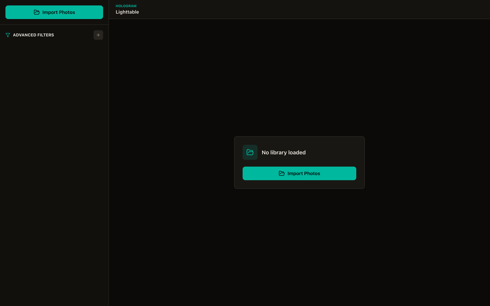
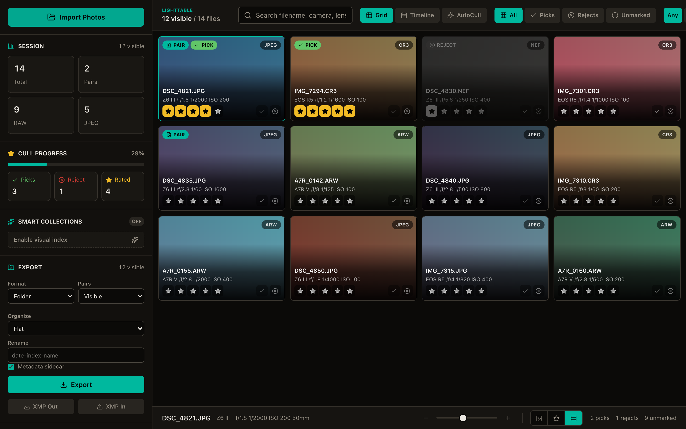
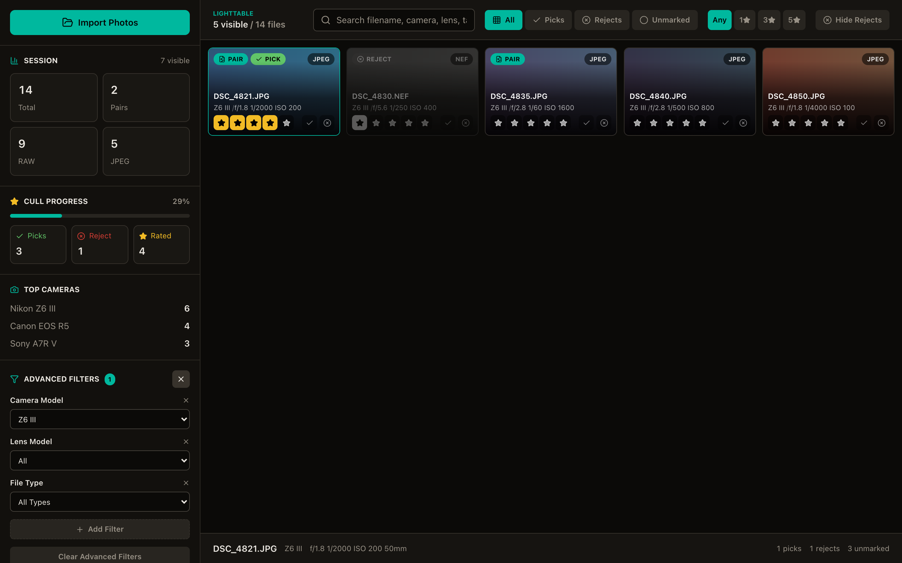
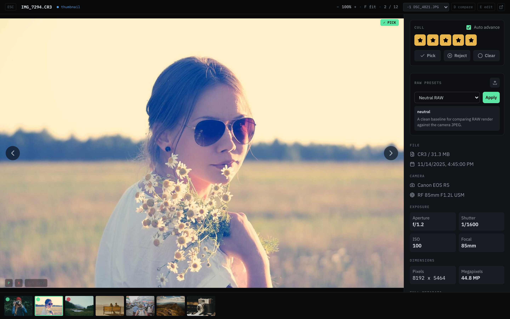
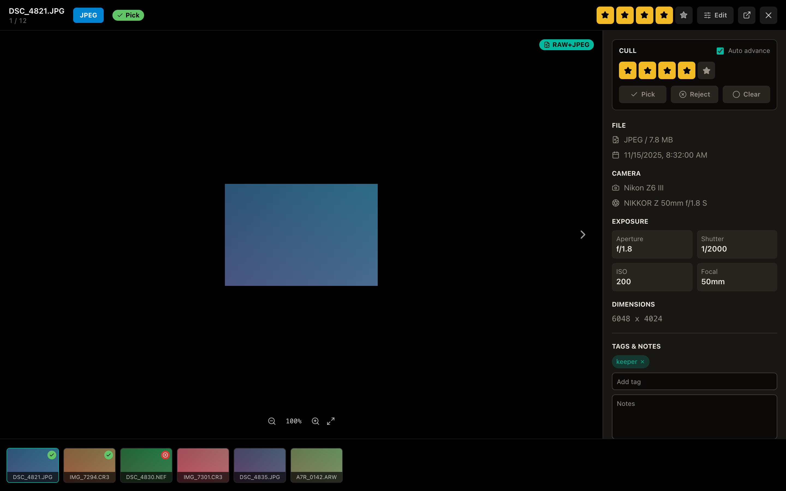
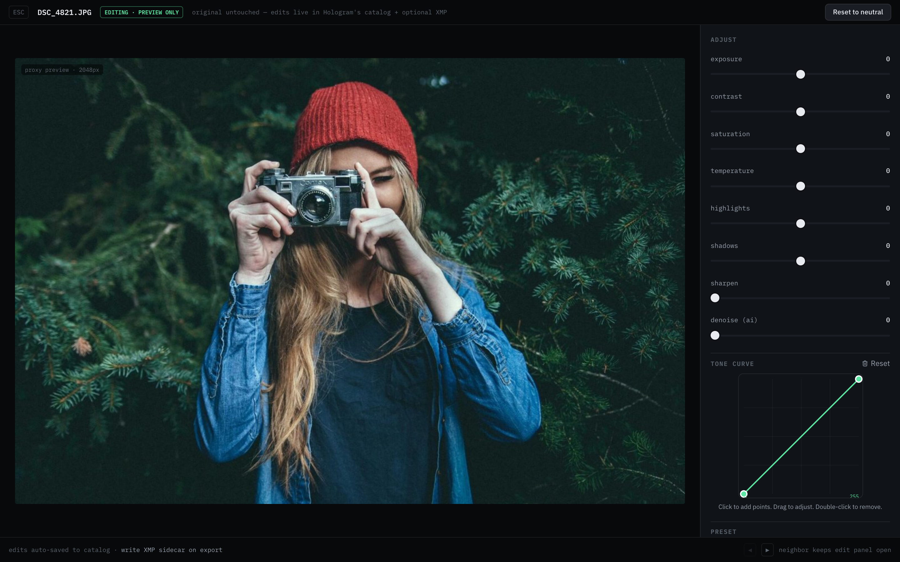
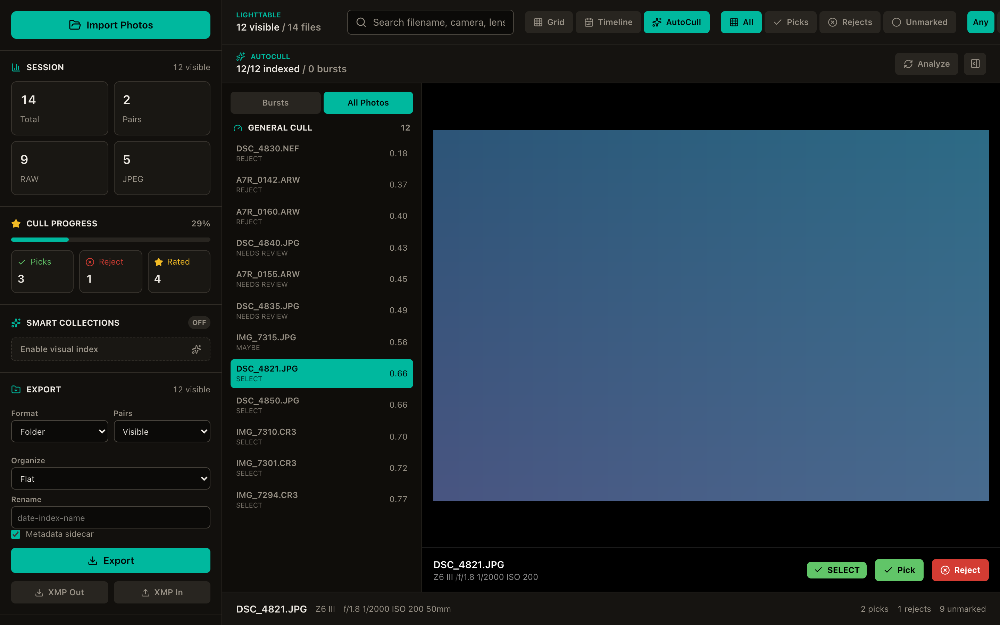

# :camera: Hologram

> [!NOTE]
> Hologram is currently in active development. Expect rough edges.

**Hologram** is a pro-grade photo management and culling application built for photographers who want total control over their files without a bloated editing environment. It handles RAW+JPEG workflows, advanced EXIF-based filtering, and intelligent organization — and it never modifies your originals.

No cloud lock-in. No black-box automations. Just clean, local photo organization.

**AutoCull** learns from your picks, rejects, ratings, and burst winner choices using DINOv2 visual embeddings and an on-device boosted-tree ranker — so first-pass culling gets faster over time without touching a single original.

## Design

Hologram follows the **Studio×Deck** visual direction: a near-black shell with a 52 px icon rail, a 248 px contextual Deck panel, and a bottom HUD. The accent palette uses spring-green (`#5ce8a4`) for picks/selects, amber for ratings, red for rejects, and IBM Plex Sans + Mono throughout. Photos are the hero; chrome recedes.

## Screenshots

| Welcome | Grid View |
|---------|-----------|
|  |  |

| Filtered Grid | Photo Viewer |
|---------------|--------------|
|  |  |

| RAW+JPEG Paired View | Adjustments Panel |
|----------------------|-------------------|
|  |  |

| AutoCull View |
|---------------|
|  |

## Features

- **File-first library** — scan any folder; RAW+JPEG pairs are detected and treated as one logical photo
- **Dense grid browser** — adjustable thumbnail size (120–520 px), per-tile detail levels, chronological timeline grouping
- **EXIF-powered filtering** — camera, lens, shutter, aperture, ISO, focal length, date, flash, white balance; composable and saveable as named searches
- **Rapid culling** — pick/reject/unmark (P/X/U) and 0–5 star ratings from anywhere; optional auto-advance; session progress tracking
- **AutoCull** — burst/similarity cluster analysis with ML-backed recommendations (SELECT / MAYBE / REJECT / NEEDS_REVIEW), adjustable reject threshold, bulk-apply, and taste-learning via pairwise preference training
- **Loupe viewer** — 50–1200% zoom, fit/100% shortcuts, progressive quality loading, RAW↔JPEG toggle, side-by-side compare
- **Non-destructive adjustments** — exposure, contrast, saturation, tone curve, presets, LUT/XMP import; preview-only, originals untouched
- **Smart Collections** — local background visual indexing (opt-in) for automatic similarity groupings
- **Export** — filtered set to folder/zip/Lightroom structure; configurable pair handling, rename patterns, XMP sidecars

## Roadmap

See [GitHub Issues #6](https://github.com/ThatXliner/Hologram/issues/6)

## Long Description

Hologram is for photographers who want clarity and control — who shoot in full manual, wrestle with dynamic range, and compare in-camera JPEGs to flat RAWs with clinical curiosity. Built for those who want easy access to their RAWs "just on the filesystem," Hologram provides a professional, file-first view of your work.

Organize by folder, EXIF, camera, or custom rules. Compare technique over time. Track when you nailed a shot manually versus let the camera decide. Pair JPEG previews with RAW originals and see how your vision evolved. Use AutoCull to rank the current set with DINOv2-backed visual embeddings, perceptual focus/color/texture features, technical scoring, and behavior-aware boosted recommendations.

And most importantly: it never touches your files. Never.

## Manifesto

We believe photos are data — rich, nuanced, untampered data.

We believe in ownership, not outsourcing.
We believe in understanding exposure, not just applying filters.
We believe EXIF is not just metadata — it's the story of how you saw the light.

We reject software that buries photos behind AI guesswork.
We reject platforms that hide your RAWs, blur your edits, or downsample your history.

Hologram is for the ones who care how the shot was made.
Not just how it looks.
