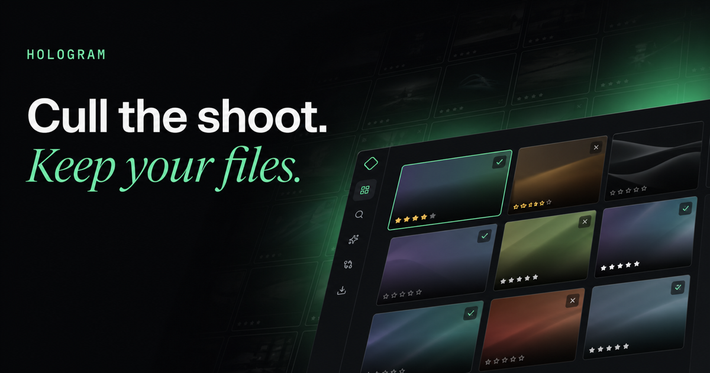
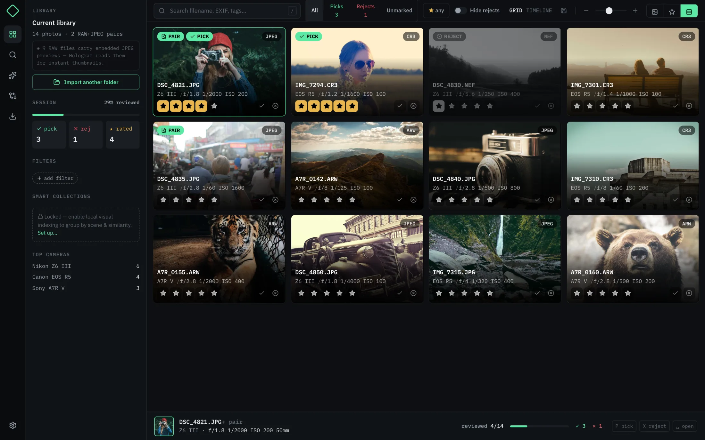
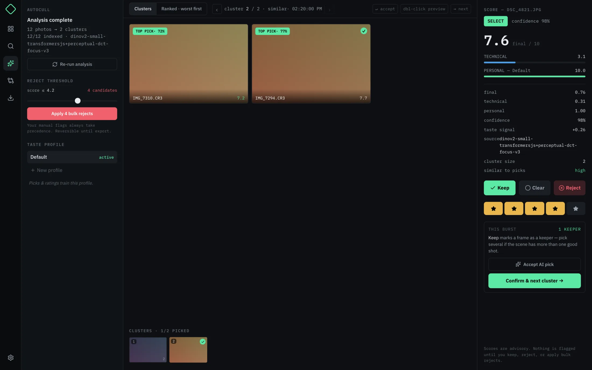
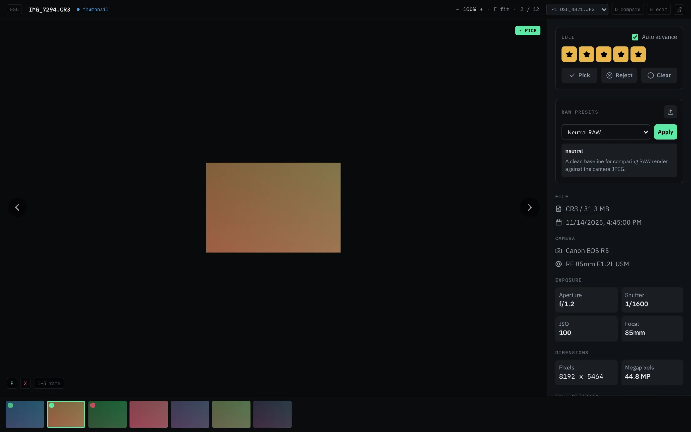
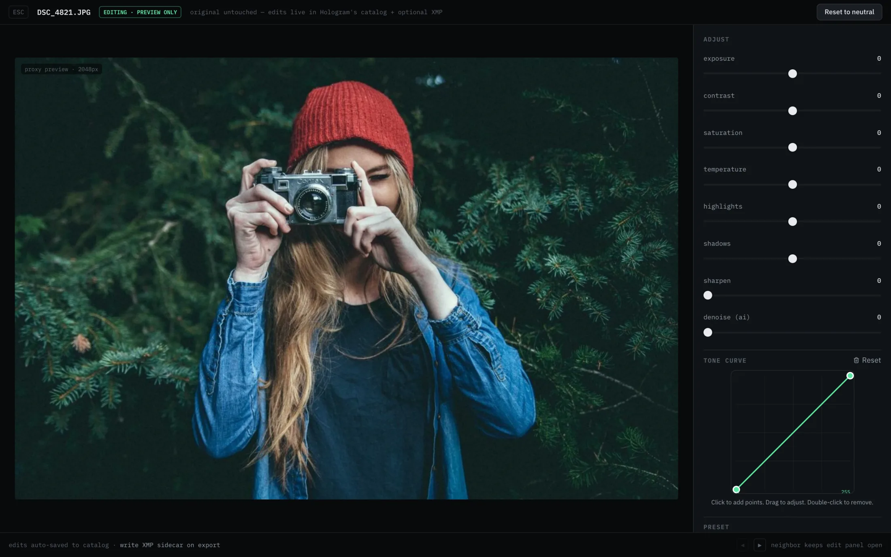
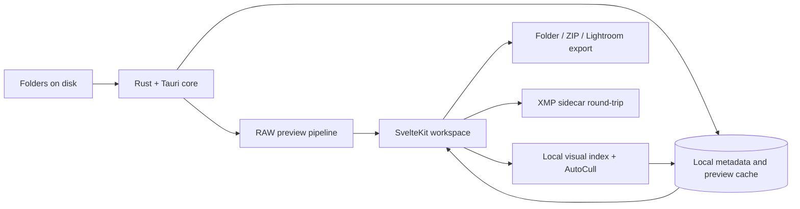

<p align="center">
  
</p>

<h1 align="center">Hologram</h1>

<p align="center">
  <strong>A local-first photo culling and management workspace for photographers who want control of their files.</strong>
</p>

<p align="center">
  RAW+JPEG pairing · keyboard-first culling · deep EXIF search · explainable local AutoCull
</p>

<p align="center">
  <a href="https://github.com/ThatXliner/Hologram/actions/workflows/build.yml"></a>
  <a href="https://nightly.link/ThatXliner/Hologram/workflows/build/main"></a>
  
</p>

<p align="center">
  <a href="https://bryanhu.com/Hologram/">Website</a>
  ·
  <a href="https://nightly.link/ThatXliner/Hologram/workflows/build/main">Download nightly</a>
  ·
  <a href="https://github.com/ThatXliner/Hologram/issues/6">Roadmap</a>
</p>

---

Hologram reads the folders you already own and gives you a fast, dense workspace for turning a shoot into a set of keepers. It does not require a cloud library, proprietary photo vault, or heavyweight editing catalog.

Point it at a folder. Hologram streams previews, pairs RAWs with their camera JPEGs, exposes the metadata behind every frame, and keeps the next decision one key away.

> [!IMPORTANT]
> Hologram is under active development. Nightly builds are usable, but expect rough edges and evolving workflows.

## See the whole shoot

<p align="center">
  
</p>


## One uninterrupted workflow

| Stage | What Hologram does |
| --- | --- |
| **Import** | Scans a normal folder and streams thumbnails progressively. Embedded RAW previews are used when available. |
| **Browse** | Shows a dense adjustable grid or chronological timeline with filename, camera, exposure, pairing, rating, and flag state. |
| **Cull** | Pick, reject, unmark, and rate without leaving the keyboard. Optional auto-advance turns review into one decision per frame. |
| **Inspect** | Zoom from fit to 1200%, switch between RAW and JPEG, compare neighboring frames, and inspect full EXIF. |
| **Organize** | Search filenames and metadata, compose filters, save searches, tag frames, and build opt-in local Smart Collections. |
| **Deliver** | Export the visible set to a folder, ZIP, or Lightroom-ready structure with pair handling, renaming, and XMP sidecars. |

### Built for real camera files

- Broad RAW support, including CR2, CR3, NEF, ARW, DNG, RAF, ORF, RW2, and more
- RAW+JPEG pairs represented as one logical photograph
- Embedded JPEG extraction for fast first previews
- Progressive loading from thumbnail → embedded preview → full resolution
- Local metadata and preview caches for repeat visits
- Non-destructive preview adjustments and explicit export

## AutoCull, without the oracle act

<p align="center">
  
</p>

AutoCull groups bursts and visually similar frames, produces **SELECT / MAYBE / REJECT / NEEDS_REVIEW** recommendations, and exposes the signals behind each result. Local DINOv2 embeddings are combined with perceptual and technical features, then adjusted by an on-device preference model trained from your picks, ratings, and burst winners.

- Review one cluster at a time or rank the entire shoot worst-first
- Inspect technical, personal, final, and confidence scores independently
- Adjust the reject threshold before applying any bulk action
- Train and switch between named taste profiles
- Keep manual flags authoritative over every recommendation
- Run indexing and inference locally

## Loupe, compare, adjust

| Loupe and EXIF | Preview-only adjustments |
| --- | --- |
|  |  |

More views: [RAW+JPEG pairing](screenshots/05-viewer-paired.png) · [filtered library](screenshots/03-grid-filtered.png) · [first run](screenshots/01-welcome.png)

## The mouse is optional

The culling vocabulary stays available wherever a photograph is active.

| Key | Action |
| --- | --- |
| <kbd>←</kbd> <kbd>↑</kbd> <kbd>→</kbd> <kbd>↓</kbd> | Previous / next photograph |
| <kbd>P</kbd> | Pick |
| <kbd>X</kbd> | Reject |
| <kbd>U</kbd> | Clear flag |
| <kbd>0</kbd>–<kbd>5</kbd> | Set star rating |
| <kbd>R</kbd> | Toggle RAW / JPEG |
| <kbd>D</kbd> | Toggle comparison |
| <kbd>E</kbd> | Toggle adjustments |
| <kbd>F</kbd> | Fit photograph |
| <kbd>+</kbd> / <kbd>−</kbd> | Zoom in / out |
| <kbd>O</kbd> | Open in the system viewer |
| <kbd>Esc</kbd> | Close the current surface or reset zoom |

## Architecture



| Layer | Technology |
| --- | --- |
| Desktop shell and system integration | Tauri 2 |
| File scanning, RAW previews, metadata, caching, export | Rust |
| Product interface | SvelteKit 5 + TypeScript |
| Styling | Tailwind CSS 4 + IBM Plex Sans / Mono |
| Local visual features | Transformers.js + DINOv2 embeddings |
| Packaging and builds | Bun + Vite + GitHub Actions |

The boundary is intentional: filesystem-heavy and performance-sensitive work lives behind typed Tauri commands; the Svelte layer owns the dense interactive workflow.

## Try it

The fastest path is the latest artifact from the main branch:

**[Download a nightly build](https://nightly.link/ThatXliner/Hologram/workflows/build/main)**

Nightly artifacts are produced for macOS, Windows, and Linux. They are development builds rather than polished releases.

## Build from source

You will need [Bun](https://bun.sh/), a Rust toolchain, and the platform dependencies required by Tauri.

```bash
git clone https://github.com/ThatXliner/Hologram.git
cd Hologram
bun install
bun run tauri dev
```

Useful project commands:

```bash
bun run check        # Svelte and TypeScript diagnostics
bun run build        # Production frontend build
bun run screenshots  # Regenerate deterministic product screenshots
```

## Principles

1. **Your files remain files.** Hologram works with the filesystem instead of hiding a library inside a proprietary vault.
2. **Local means local.** Photo analysis, visual indexing, and preference learning run on your machine.
3. **Automation must explain itself.** Recommendations expose their inputs and always yield to manual decisions.
4. **Keyboard flow is product functionality.**
5. **Photos are the hero.** Density is useful; chrome should recede.

## Status and roadmap

Hologram is being built in the open. The current roadmap lives in [issue #6](https://github.com/ThatXliner/Hologram/issues/6), and focused bug reports are welcome in [GitHub Issues](https://github.com/ThatXliner/Hologram/issues).

When reporting a photo-specific problem, please include the file format, camera model, expected behavior, and whether the file contains an embedded JPEG preview. Do not upload private photographs unless you are comfortable making them public.

---

<p align="center">
  <strong>For the ones who care how the shot was made—not just how it looks.</strong>
</p>
